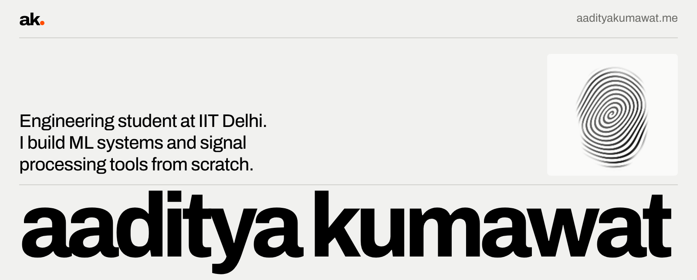

<a href="https://aadityakumawat.me">
  <picture>
    <source media="(prefers-color-scheme: dark)" srcset="banner-dark.png">
    
  </picture>
</a>

Third-year B.Tech student in Production and Industrial Engineering at IIT Delhi. I rebuild systems from first principles, then measure them against a baseline or a control until the numbers hold up.

**[aadityakumawat.me](https://aadityakumawat.me)** &nbsp;&nbsp; [aaditya@aadityakumawat.me](mailto:aaditya@aadityakumawat.me) &nbsp;&nbsp; [LinkedIn](https://www.linkedin.com/in/aaditya-kumawat-9588012b2/) &nbsp;&nbsp; [Codeforces](https://codeforces.com/profile/codeleon) (Candidate Master, peak 1935)

### Selected work

| Project | What it is | Headline result |
|---|---|---|
| [**sextant**](https://github.com/AadityaK21/sextant) | Ontology, entity resolution and cell-level lineage over an LSM storage engine written from scratch. C++20, React | 4,201 of 4,201 values replay from their source row |
| [**nanoserve**](https://github.com/AadityaK21/nanoserve) | LLM inference server with no vLLM or TGI: paged KV cache, continuous batching, a fused Triton attention kernel, INT4/INT8 | 1.65× throughput and 12× lower p99 time to first token vs static batching |
| [**stbemd-signal-processing**](https://github.com/AadityaK21/stbemd-signal-processing) | ST-BEMD, a direction-adaptive 2-D empirical mode decomposition | Tracks ridge orientation 3.3° better than the baseline under heavy noise |
| [**leetcode-company-hub**](https://github.com/AadityaK21/leetcode-company-hub) | Company Hub, a live interview-prep platform at [companyhub.fun](https://companyhub.fun). Next.js, PostgreSQL | 3,400 questions across 656 companies |
| [**qrt-stock-return-prediction**](https://github.com/AadityaK21/qrt-stock-return-prediction) | Leakage-safe next-day return prediction with purged CV and a simulator that knows the true signal | 73.7% of the attainable IC captured |
| [**llm-as-a-judge-survey**](https://github.com/AadityaK21/llm-as-a-judge-survey) | Survey of five directions in LLM-as-a-Judge, co-authored, advised by Prof. Amartansh Dubey | [Paper (PDF)](https://github.com/AadityaK21/llm-as-a-judge-survey/blob/main/llm_as_a_judge_survey.pdf) |

### Research

**Research intern, Applied AI Laboratory, HEC Lausanne** (remote, May to Jul 2026). A fully local legal-audio pipeline that produces speaker-attributed, citation-backed notes on an 8 GB GPU, with an extractive mode that cannot fabricate text. 6.9% WER and 7.9% DER on Supreme Court audio. [Case study](https://aadityakumawat.me/work/legal-audio/)

Case studies, figures and the full CV are on [aadityakumawat.me](https://aadityakumawat.me).
